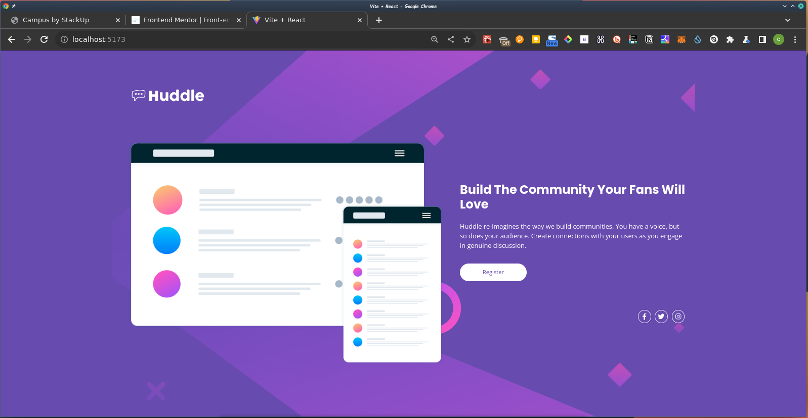

# Frontend Mentor - Huddle landing page with single introductory section solution

This is a solution to the [Huddle landing page with single introductory section challenge on Frontend Mentor](https://www.frontendmentor.io/challenges/huddle-landing-page-with-a-single-introductory-section-B_2Wvxgi0). 

## Table of contents

  - [Screenshot](#screenshot)
  - [Links](#links)
- [My process](#my-process)
  - [Built with](#built-with)
  - [Useful resources](#useful-resources)
- [Author](#author)
- [Acknowledgments](#acknowledgments)

### Screenshot

### Links

- Solution URL: [Add solution URL here](https://github.com/cyberraff/huddle)
- Live Site URL: [Add live site URL here](https://huddle-seven-phi.vercel.app/)

## My process

### Built with

- Mobile-first workflow
- [React](https://reactjs.org/) - JS library
- [Vite](https://vitejs.dev/) - React Frontend Tooling
- [Tailwind css](https://tailwindcss.com/) - For styles

### Useful resources

- [Tailwind CSS Docs](https://tailwindcss.com/) - This helped me for styling. I really liked the documentations and will use it going forward.
- [Stackoverflow](https://www.stackoverflow.com) - This platform helped answer majority of the questions i had during the challenge.

## Author

- Frontend Mentor - [@cyberraff](https://www.frontendmentor.io/profile/cyberraff)
- Twitter - [@CyberRaff_](https://twitter.com/CyberRaff_)

## Acknowledgments

I give thanks to God for being with me on this journey.
